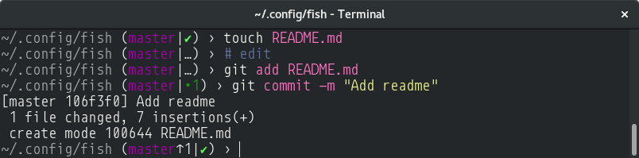

# My personal fish configuration

## The prompt

Based on the oh-my-fish theme _gnuykeaj_, with a home-relative path (`~/.config`) and minor tweaks to make it work nicely on a dark terminal. There is no blue color in the prompt.

## The window title

* `~/my-project/files` - home-relative CWD by default
* `npm run lint` - if a command is in foreground, the command with arguments

## Other

`config.fish` is the most opinionated part, including some npm related path stuff etc.
